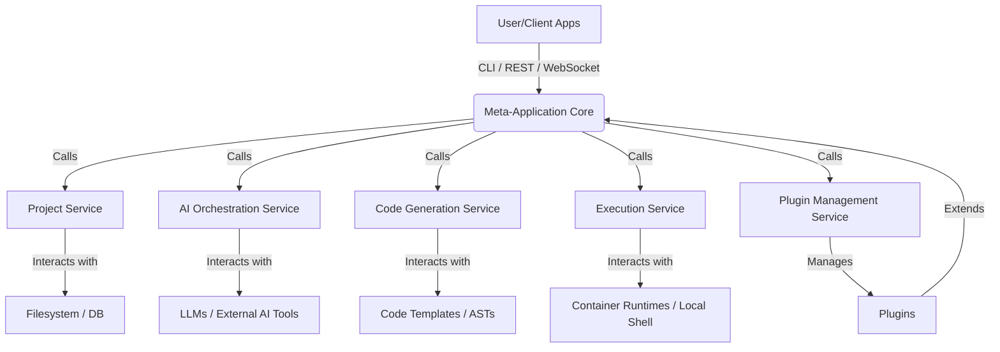

# API Documentation for the Meta-Application

This document details the Application Programming Interfaces (APIs) of the Meta-Application, an intelligent system designed to generate and manage other software applications. It covers both the external interfaces for interaction with users and other systems, and the internal interfaces that facilitate communication between the application's core components.

## Overall Architecture

The Meta-Application employs a modular, service-oriented architecture. Core functionalities like project management, AI orchestration, code generation, and execution are exposed as distinct services. These services interact through well-defined internal APIs, while external interfaces (CLI, REST, WebSockets) provide access points for users and client applications. The system is highly extensible via a plugin architecture.



## External APIs

### 1. Command Line Interface (CLI)

The CLI provides a primary interface for developers and power users to interact with the Meta-Application, manage projects, and initiate app generation processes.

*   **Entry Point**: `meta-app`
*   **Key Commands**:
    *   `meta-app init <project-name>`: Initializes a new application project.
    *   `meta-app plan <project-id>`: Generates a development plan for the specified project.
    *   `meta-app generate <project-id> [component]` : Generates code based on the plan, or a specific component.
    *   `meta-app build <project-id>`: Builds the generated application.
    *   `meta-app run <project-id>`: Runs the generated application (if runnable).
    *   `meta-app deploy <project-id>`: Deploys the generated application.
    *   `meta-app plugins list`: Lists installed plugins.
    *   `meta-app plugins install <plugin-id>`: Installs a plugin.
    *   `meta-app config get|set <key> [value]`: Manages configuration.
    *   `meta-app server start`: Starts the local REST/WebSocket server.
*   **Input/Output**: Standard I/O, JSON output for machine readability (e.g., `--json` flag).

### 2. REST API

The REST API offers a programmatic interface for integrating the Meta-Application with other tools, custom UIs, or automated workflows.

*   **Base URL**: `http://localhost:8080/api/v1` (configurable)
*   **Authentication**: API Key or OAuth2 (TBD based on deployment model).
*   **Common Headers**:
    *   `Content-Type: application/json`
    *   `Authorization: Bearer <API_KEY>` (if API Key authentication is used)
*   **Error Handling**: Standard HTTP status codes (4xx for client errors, 5xx for server errors) with JSON error bodies.

#### Endpoints:

**Projects Management (`/projects`)**
*   `POST /projects`
    *   **Description**: Create a new project.
    *   **Request Body**:
        ```json
        {
            "name": "string",
            "description": "string",
            "goal": "string"
        }
        ```
    *   **Response**: `201 Created`
        ```json
        {
            "id": "uuid",
            "name": "string",
            "description": "string",
            "goal": "string",
            "status": "initialized",
            "createdAt": "ISO_DATE_STRING"
        }
        ```
*   `GET /projects`
    *   **Description**: List all projects.
    *   **Response**: `200 OK`
        ```json
        [
            {
                "id": "uuid",
                "name": "string",
                "description": "string",
                "goal": "string",
                "status": "initialized",
                "createdAt": "ISO_DATE_STRING"
            }
        ]
        ```
*   `GET /projects/{project_id}`
    *   **Description**: Get project details.
    *   **Response**: `200 OK` (Project object)
*   `PUT /projects/{project_id}`
    *   **Description**: Update project details.
    *   **Request Body**: `Partial<Project>`
    *   **Response**: `200 OK` (Updated Project object)
*   `DELETE /projects/{project_id}`
    *   **Description**: Delete a project.
    *   **Response**: `204 No Content`

**Plans Management (`/projects/{project_id}/plans`)**
*   `POST /projects/{project_id}/plans`
    *   **Description**: Generate a new development plan for the project.
    *   **Request Body**:
        ```json
        {
            "instruction": "string" // Optional, if overriding project goal
        }
        ```
    *   **Response**: `202 Accepted` (Job ID for async operation)
        ```json
        {
            "jobId": "uuid",
            "status": "pending"
        }
        ```
*   `GET /projects/{project_id}/plans/{plan_id}`
    *   **Description**: Get plan details.
    *   **Response**: `200 OK` (Plan object)
*   `GET /projects/{project_id}/plans/latest`
    *   **Description**: Get the latest plan for the project.
    *   **Response**: `200 OK` (Plan object)

**Code Generation (`/projects/{project_id}/generate`)**
*   `POST /projects/{project_id}/generate`
    *   **Description**: Initiate code generation based on the plan.
    *   **Request Body**:
        ```json
        {
            "planId": "uuid",    // Optional, defaults to latest plan
            "component": "string" // Optional, to generate a specific component
        }
        ```
    *   **Response**: `202 Accepted` (Job ID for async operation)
        ```json
        {
            "jobId": "uuid",
            "status": "pending"
        }
        ```

**Jobs/Tasks (`/jobs`)**
*   `GET /jobs/{job_id}`
    *   **Description**: Get status and details of a specific long-running operation (e.g., generate, build, run, plan generation).
    *   **Response**: `200 OK`
        ```json
        {
            "id": "uuid",
            "type": "generate|build|run|plan",
            "projectId": "uuid",
            "status": "pending|running|complete|failed",
            "progress": 0-100,
            "logs": ["log message 1", "log message 2"],
            "result": { /* job-specific result data */ },
            "error": "string" // if failed
        }
        ```

**Configuration (`/config`)**
*   `GET /config`
    *   **Description**: Get all global configuration settings.
    *   **Response**: `200 OK` (JSON object of config)
*   `GET /config/{key}`
    *   **Description**: Get a specific configuration setting.
    *   **Response**: `200 OK` (JSON value)
*   `PUT /config/{key}`
    *   **Description**: Update a specific configuration setting.
    *   **Request Body**: Raw value (JSON, string, number, boolean)
    *   **Response**: `200 OK` (Updated value)

**Plugins (`/plugins`)**
*   `GET /plugins`
    *   **Description**: List available and installed plugins.
    *   **Response**: `200 OK`
        ```json
        [
            { "id": "plugin-name", "version": "1.0.0", "description": "...", "installed": true },
            { "id": "another-plugin", "version": "0.5.0", "description": "...", "installed": false }
        ]
        ```
*   `POST /plugins/install`
    *   **Description**: Install a plugin.
    *   **Request Body**:
        ```json
        {
            "pluginId": "string",
            "version": "string" // Optional, defaults to latest
        }
        ```
    *   **Response**: `202 Accepted` (Job ID for async operation)

### 3. WebSocket API

The WebSocket API provides real-time updates on long-running processes (e.g., code generation, plan execution, build logs) and internal events.

*   **Endpoint**: `ws://localhost:8080/api/v1/ws`
*   **Message Format**: JSON objects with a `type` field and a `payload`.
*   **Subscription**: Clients can subscribe to specific job IDs or project events by sending an initial `subscribe` message upon connection.
    *   Example Subscription Message:
        ```json
        {
            "type": "subscribe",
            "payload": {
                "topics": ["job:uuid-of-job", "project:uuid-of-project", "global:logs"]
            }
        }
        ```
*   **Message Types (Examples)**:
    *   `{"type": "job_update", "payload": {"jobId": "uuid", "status": "running", "progress": 50, "logs": "Generating file X..."}}`
    *   `{"type": "project_event", "payload": {"projectId": "uuid", "event": "plan_generated", "data": {"planId": "uuid"}}}`
    *   `{"type": "log_message", "payload": {"level": "info", "message": "Service started.", "timestamp": "ISO_DATE_STRING"}}`
    *   `{"type": "error", "payload": {"code": "ERR_INTERNAL", "message": "Something went wrong."}}`

## Internal APIs

The internal APIs define the interfaces between the core services of the Meta-Application, ensuring modularity and maintainability.

### 1. Core Services API

These are the primary interfaces for interacting with the fundamental capabilities of the meta-application.

#### `IProjectService`
Manages the lifecycle of application projects.

```typescript
interface IProjectService {
    createProject(goal: string, name?: string, description?: string): Promise<Project>;
    getProject(projectId: string): Promise<Project>;
    updateProject(projectId: string, updates: Partial<Project>): Promise<Project>;
    deleteProject(projectId: string): Promise<void>;
    listProjects(): Promise<Project[]>;
    getProjectFiles(projectId: string): Promise<ProjectFile[]>;
    addProjectFile(projectId: string, path: string, content: string): Promise<ProjectFile>;
    updateProjectFile(projectId: string, path: string, content: string): Promise<ProjectFile>;
    deleteProjectFile(projectId: string, path: string): Promise<void>;
}
```

#### `IAIOrchestrationService`
Interacts with LLMs and other AI tools to generate plans, code, or perform analysis.

```typescript
interface IAIOrchestrationService {
    generatePlan(projectId: string, context: GenerationContext): Promise<Plan>;
    generateCode(projectId: string, planStep: PlanStep, context: GenerationContext): Promise<GeneratedCode>;
    refactorCode(projectId: string, filePath: string, instruction: string, context: GenerationContext): Promise<GeneratedCode>;
    analyzeCode(projectId: string, filePath: string): Promise<CodeAnalysisResult>;
}
```

#### `ICodeGenerationService`
Transforms plans/AI outputs into actual code, managing templates and project structure.

```typescript
interface ICodeGenerationService {
    applyPlan(projectId: string, plan: Plan): Promise<void>;
    generateComponent(projectId: string, componentType: string, spec: any): Promise<GeneratedCode>;
    saveGeneratedCode(projectId: string, generatedCode: GeneratedCode): Promise<void>;
    getProjectFileSystem(projectId: string): Promise<ProjectFileSystem>; // Abstraction over project files
}
```

#### `IExecutionService`
Handles building, running, and deploying generated applications.

```typescript
interface IExecutionService {
    buildApplication(projectId: string): Promise<ExecutionResult>;
    runApplication(projectId: string): Promise<ExecutionResult>;
    deployApplication(projectId: string, target: DeploymentTarget): Promise<ExecutionResult>;
    getLogs(projectId: string, jobId: string): Promise<string[]>;
    // Stream logs for a running job/app
    streamLogs(projectId: string, jobId: string): AsyncIterable<string>;
}
```

#### `IPluginManagerService`
Manages the loading, lifecycle, and invocation of plugins.

```typescript
interface IPluginManagerService {
    loadPlugin(pluginId: string): Promise<void>;
    unloadPlugin(pluginId: string): Promise<void>;
    listPlugins(): Promise<PluginInfo[]>;
    invokePluginHook(hookName: string, args: any[]): Promise<any[]>;
    getPluginConfig(pluginId: string): Promise<Record<string, any>>;
    setPluginConfig(pluginId: string, config: Record<string, any>): Promise<void>;
}
```

### 2. Plugin System API

Plugins are first-class citizens for extending the Meta-Application's capabilities.

*   **Plugin Structure**: A plugin is typically a directory containing:
    *   `plugin.json`: Metadata (name, version, description, entry point).
    *   `index.js` (or `index.ts`): The main entry point defining the plugin's interface.

*   **`IPlugin` Interface**:
    Plugins must export an object conforming to the `IPlugin` interface from their main entry file.

    ```typescript
    import { Project, Plan, PlanStep, GenerationContext, GeneratedCode, ExecutionResult, CLICommand } from '@meta-app/core/types';
    import { ICodeGeneratorRegistry, ITemplateEngine } from '@meta-app/core/interfaces';
    import { Command as CommanderCommand } from 'commander';
    import { Application as ExpressApplication } from 'express';

    interface IPlugin {
        id: string;
        name: string;
        version: string;
        description?: string;
        configSchema?: JSONSchema7; // JSON Schema for plugin-specific configuration

        /**
         * Hooks are functions invoked at specific lifecycle stages or events.
         * They can modify data, perform side effects, or register new components.
         */
        hooks?: {
            // Project Lifecycle
            onProjectInit?: (project: Project) => Promise<void> | void;
            onBeforePlanGeneration?: (context: GenerationContext) => Promise<GenerationContext> | GenerationContext;
            onAfterPlanGeneration?: (project: Project, plan: Plan) => Promise<void> | void;
            onBeforeCodeGeneration?: (planStep: PlanStep, context: GenerationContext) => Promise<[PlanStep, GenerationContext]> | [PlanStep, GenerationContext];
            onAfterCodeGeneration?: (project: Project, generatedCode: GeneratedCode) => Promise<void> | void;
            onBuildStart?: (project: Project) => Promise<void> | void;
            onBuildComplete?: (project: Project, result: ExecutionResult) => Promise<void> | void;
            onRunStart?: (project: Project) => Promise<void> | void;
            onRunComplete?: (project: Project, result: ExecutionResult) => Promise<void> | void;
            onDeployStart?: (project: Project) => Promise<void> | void;
            onDeployComplete?: (project: Project, result: ExecutionResult) => Promise<void> | void;

            // Extension Points
            addCLICommands?: (cli: CommanderCommand) => void;
            addRestEndpoints?: (app: ExpressApplication) => void; // For adding custom REST API routes
            registerCodeGenerator?: (generatorRegistry: ICodeGeneratorRegistry) => void;
            registerTemplateEngine?: (templateEngine: ITemplateEngine) => void;
            registerAIProvider?: (aiProviderRegistry: IAIProviderRegistry) => void; // For integrating custom AI models
            // ... more hooks as the system evolves
        };

        /**
         * Services provided by the plugin. These can be custom implementations
         * of core interfaces or entirely new services.
         */
        services?: {
            [serviceName: string]: any; // e.g., custom IAIProvider, ICodeFormatter
        };
    }
    ```

*   **Plugin Context**: When a hook is invoked, plugins receive a context object that provides access to core services (e.g., `projectService`, `aiService`, `logger`) and plugin-specific configuration.

### 3. Data Models

Consistent data models are crucial for seamless interaction across APIs.

#### `Project`
Represents an application project managed by the Meta-Application.

```typescript
interface Project {
    id: string; // UUID
    name: string;
    description: string;
    goal: string; // The primary goal/request for the application
    status: 'initialized' | 'planning' | 'generating' | 'building' | 'running' | 'completed' | 'failed';
    createdAt: Date;
    updatedAt: Date;
    config: Record<string, any>; // Project-specific configuration
    // References to plans, latest generated artifacts, etc.
}
```

#### `ProjectFile`
Represents a file within a project's workspace.

```typescript
interface ProjectFile {
    projectId: string;
    path: string; // Relative path from project root (e.g., "src/index.js")
    content: string; // File content
    lastModified: Date;
    isGenerated: boolean; // True if the file was generated by the meta-app
}
```

#### `Plan`
A structured plan for building an application, derived from the project goal.

```typescript
interface Plan {
    id: string; // UUID
    projectId: string;
    description: string;
    steps: PlanStep[];
    status: 'pending' | 'in-progress' | 'completed' | 'failed';
    createdAt: Date;
    completedAt?: Date;
}
```

#### `PlanStep`
An individual task within a plan.

```typescript
interface PlanStep {
    id: string; // UUID
    description: string;
    type: 'design' | 'code' | 'test' | 'build' | 'deploy' | 'refactor' | 'research' | 'user_input';
    status: 'pending' | 'in-progress' | 'completed' | 'failed';
    dependencies: string[]; // IDs of other steps this step depends on
    output?: any; // Output from this step (e.g., file paths, test results)
    instruction?: string; // Specific instructions for AI or generation
    targetComponent?: string; // e.g., "frontend", "backend-api"
    assignedAIModel?: string; // Which AI model should handle this step
}
```

#### `GenerationContext`
Contextual information passed to AI and generation services to guide their output.

```typescript
interface GenerationContext {
    projectId: string;
    currentGoal: string; // The specific goal for the current generation task
    currentPlanStep?: PlanStep; // The plan step currently being executed
    currentProjectState: {
        files: { path: string, content: string }[]; // Subset of relevant files
        metadata: Record<string, any>; // Other relevant project metadata
    };
    history: string[]; // Recent interactions/decisions/logs
    aiConfig: { // Configuration for AI models used in this context
        modelName: string;
        temperature: number;
        // ... other AI specific parameters
    };
}
```

#### `GeneratedCode`
Represents the output of a code generation task, describing file changes.

```typescript
interface GeneratedCode {
    files: {
        path: string; // Relative path from project root
        content: string;
        action: 'create' | 'update' | 'delete'; // What to do with the file
    }[];
    logs?: string[];
    warnings?: string[];
    // Any other metadata about the generation process
}
```

#### `ExecutionResult`
Result of a build, run, or deploy operation.

```typescript
interface ExecutionResult {
    success: boolean;
    logs: string[];
    output?: string; // e.g., URL for deployed app, console output, exit code
    error?: string; // If `success` is false
    durationMs: number;
    // Any other relevant metrics or artifacts
}
```

#### `DeploymentTarget`
Defines where an application should be deployed.

```typescript
interface DeploymentTarget {
    type: 'aws_s3' | 'vercel' | 'kubernetes' | 'local_docker'; // Example types
    config: Record<string, any>; // Provider-specific configuration (e.g., bucket name, region, API key)
}
```

#### `CodeAnalysisResult`
The outcome of an AI-driven code analysis.

```typescript
interface CodeAnalysisResult {
    suggestions: {
        type: 'improvement' | 'bug' | 'security' | 'refactor';
        description: string;
        filePath: string;
        line?: number;
        severity: 'low' | 'medium' | 'high';
    }[];
    summary: string;
    rawAIOutput?: string;
}
```

## Conclusion

This document provides a foundational understanding of the Meta-Application's API surfaces. As the project evolves, these specifications will be refined and expanded to support new features and integrations.